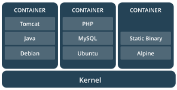

## What is a Container

---
### A container is

- <!-- .element: class="fragment" data-fragment-index="1" -->any receptacle or enclosure for holding a product used in storage, packaging, and shipping [(Wikipedia)](https://en.wikipedia.org/wiki/Container)
- <!-- .element: class="fragment" data-fragment-index="2" -->a lightweight, stand-alone, executable package of a piece of software that includes everything needed to run it [(Docker documentation)](https://www.docker.com/what-container)
- <!-- .element: class="fragment" data-fragment-index="3" -->chroot on steroids
- <!-- .element: class="fragment" data-fragment-index="4" -->all of the above

Note:
Possibly explain chroot.

---
### Containers

- Provide a mechanism to run applications in separated spaces.
- With minimal overhead.

---
### Containers 

- Primarily based on Linux kernel tech
    - Control Groups: Resource tracing & limiting
    - Namespaces: Resource access.
- Different flavours, same underlying tech.
    - E.g.: LXD, Mesos, Docker.

Note:
- So all these implementations provide an interface to the same underlying mechanisms.
- They are also opinionated in their own way, for example lxc favours system containers (full userspace of a system in a container) and provides a more 'vm-like' way of setting up a container.. Docker and mesos focus on packaged applications, Docker only likes docker images, and mesos will run anything that is executable.
- Resources: users, devices, process ids, etc.
